# Sistemi Operativi

## Gestione input/output e interruzioni

Le componenti di un calcolatore sono:

+ **CPU** (Central Processing Unit): elabora i dati
+ **Memoria**: memorizza i dati
+ **Dispositivi di I/O** (Input/Output): permettono di comunicare con l'esterno (es. Tastiera schermo, dischi rigidi ecc.)
+ **Bus** (dati, indirizzi, controllo): permette di collegare le componenti tra loro


I dispositivi di inuput/output comunicano col bus tramite le interfacce, le quali leggono dal bus indirizzi, leggono e scrivono sul bus dati e leggono e scrivono sul bus di controllo. Grazie alle interfacce i dispositivi e la CPU possono procedere in modo **asincrono**, ognuno alla propria velocità (la CPU è molto più veloce dei dispositivi di I/O).
L'interfaccia fornisce i seguenti pseudoregistri:

+ DREG: per lo scambio dati
+ CREG: per i comandi alla periferica
+ SREG: per leggere lo stato della periferica
  
La CPU accede ai registri delle interfacce con le seguenti tecniche:
+ I/O mappato in memoria: una parte della memoria è dedicata alla comunicazione con i dispositivi di I/O
+ I/O isolato: la CPU accede ai dispositivi di I/O tramite istruzioni dedicate (IN, OUT), e interagiscono i dispositivi tramite porte identificate da un numero (es. 21H). Lo spazio di indirizzamento è distinto da quello della memoria.

Nel sistema isolato, le istruzioni dedicate per l'I/O generano dei cicli di bus analoghi alle altre istruzioni, solo che vengono usate due linee distinte:
+ IORC (read command)
+ IOWC (write command)

Il processore x86 usa il metodo I/O isolato.

### Porte dell'interfaccia I/O

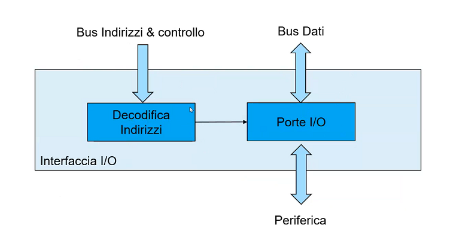

+ **Porte di input** dalla periferica: presentano un buffer three-state; l'uscita è abilitata quando IORC è asserito
+ **Porte di output** verso la periferica: dotate di latch per memorizzare il dato; l'acquisizione avvienre quando IOWC è asserito.
  
Il buffer è essenziale! In quanto la CPU è molto puù veloce delle periferiche, quindi potrebbe leggere o scrivere prima che la periferica sia pronta. Infatti non vi è nessun tipo di sincronizzazione tra programma in esecuzione e periferiche.

### Modalità di esecuzione I/O

Le tecniche fondamentali per la gestione delle periferiche sono:
+ gestine a controllo di programma (obsoleta)
+ sotto controllo di interruzione
+ tramite accesso diretto alla memoria (DMA)

le prime due sono applicate quando si ha a che fare con dispositivi lenti (tipo le stampanti), mentre l'ultima è perfetta per dispositivi che trasmettono grandi quantità di memoria (tipo gli hard disk).

#### Controllo di programma

Consideriamo una periferica molto lenta come la stampante. Questa tecnica implementa un protocollo di hand shaking tra la CPU e la periferica:
+ DAV (Data Available): indica che il dato è disponibile
+ DAC (Acknowledge): indica che il dato è stato ricevuto e che la CPU può inviarne un altro
Il DAV è generato dalla CPU, mentre il DAC dalla periferica. Il secondo serve per evitare che la CPU sovrascriva il dato prima che la periferica lo abbia ricevuto. Il problema è che la CPU spreca un sacco di tempo aspettando che la periferica invii il DAC:
<br>
<br>
<br>

```assembly
STAMPA: MOV AL,[SI]
        OUT E1H,AL
ATTESA: IN AL,E1H       ;
        AND AL, 1       ;in attesa che DAC = 0 dalla stampante
        JNZ ATTESA      ;
        INC SI
        LOO STAMPA
        RET        
```
nel loop di attesa, la CPU spreca tempo (attesa **attiva**) 

#### Sotto controllo di interruzione

Per risolvere il problema dell'attesa attiva, si usa il controllo di interruzione. All'interruzione viene eseguita una routine di servizio (ISR) che si occupa di gestire la periferica. Il programma principale non si occupa più di gestire la periferica, ma si limita a inviare i dati. L'esecuzione della routine abbiene tra l'esecuzione di due istruzioni.

Ipotiziamo un modello semplificato che gestisce una sola periferica. L  linea INTR in ingresso alla CPU indica una richiesta di interruzione, che può essere attivato solo se la CPU ha abilitato le interruzioni attraverso il flag IE. Quando viene riconosciuta una interruzione IINTR la CPU deve azzerare IE, in modo da non essere interrotta, e fare fetch dell'istruzione all'indirizzo 0 (senza tocca il PC). A tale indirizzo dovrà essere presente una CALL alla procedura di gestione dell'interrupt. la procedura termina con **IRET**, che ripristina il valore di IE e riprende l'esecuzione del programma principale.


vediamo di cosa si occupa la routine di servizio:

+ salvare sullo stack **PSW** e registri utilizzati;
+ trasferire il prossimo dato 
+ disasserire la richiesta di interruzione (altrimenti ripartirebbe subito l'interrupt)
+ ripristinare i registri e il PSW
+ ritornare al programma interrotto (tramite IRET)

Vediamo invece cosa succede se ci sono **più periferiche**. Si hanno i seguenti problemi:

+ come si fa a capire quale periferica ha generato l'interruzione?
+ scegliere la routine corrispondente
+ gestire le priorità
+ gestire l'interrompibilità della routine di servizio da parte di periferica a priorità maggiore

**discriminazione da programma**: Ogni periferica modifica un bit della porta **ISR** se vuole generare un'interruzione. Leggendo la porta ISR (interrupt service routine) si può capire quale periferica ha generato l'interruzione. Il problema è che la CPU deve leggere la porta ISR per capire quale periferica ha generato l'interruzione, e questo richiede tempo. La priorità è gestita tramite la vicinanza dalla CPU: chi è più vicino ha maggiore priorità. La gestione dell'interrompibilità è gestita tramite un bit di mascheramento per ogni periferica. Se il bit è 1, la periferica non può generare interruzioni.
Per superare l'inefficienza dovuta alla lettura della porta ISR possiamo vettorizzare le interruzioni: 

+ il dispositivo indica il numero di interrupt (**IRQ** i)
+ la CPU esegue direttamente la routine di servizio corrispondente all'interrupt, usando la tabella TABIR (contiene gli indirizzi delle routine di servizio). 
+ L'IRQ i viene acuqisito tramite un ciclo di bus e il segnale INTA indica che la CPU ha ricevuto l'interruzione e attende sul bus il numero di interruzione. 
  
La priorità delle interruzioni è stabilita da un **PIC** (programmable interrupt controller) che funge da arbitro di priorità, ed è lui che passa il corretto IRQ alla CPU (tramite bus dati). E' programmabile tramite delle porte di input output e un collegamento con il bus indirizzi. Usa due porte di input output: una per la programmazione; una per il mascheramento delle interruzioni, per gestire l'interrompibilità.
All'interno del PIC troviamo l'**IRR** (interrupt request register), una parte di logica di controllo, un **MR** (mask register) e un ISR (in service register), che indica al PIC l'interruzione che in quel momento è in esecuzione; infine troviamo il **TR** (type register), formato da 8 bit, di cui 5 sono programmabili e tre si riferiscono all'interruzione che è stata generata (se il PIC gestisce 8 registri). Il **TR** è quello che viene messo un bus dati in risposta all'INTA. L'ISR ha il compito di disattivare le interruzioni a più bassa priorità. Nella routine di gestione si deve inviare un EOI (end of interrupt) al PIC - visto che il PIC è esterno alla CPU - prima di fare IRET, in modo da riattivare le interruzioni (riattivare ISR nel bit corrispondente all'interruzione appena avvenuta).   

**Daisy-chain**: Tipo di collegamento in cui la posizione dei dispositivi all'interno di una catena, dà la priorità a quel dispositivo. Questo rende la daisy chain poco flessibile. A ogni periferica è associato un **LDC**.

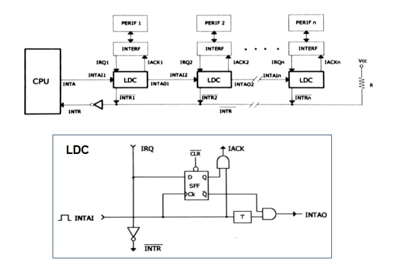

Una volta ricevuta la rischiesta di interruzione tramite INTR, la CPU asserisce INTA, che viene presentato a tutta la daisy chain, fintanto che non viene individuata la periferica più vicina che ha effettuato la richiesta di interruzione tramite IRQ. In caso di richieste concorrenti, la prima a essere accolta è quella della periferica più vicina alla CPU. L'inerfaccia della paeriferica che riceve l'IACK, presenta l'id corrispondente sul bus dati.

#### Accesso diretto alla memoria (DMA)

Ideale per i dispositivi che leggono e scrivono tanti dati per volta e molto velocemente (es. schede di rete, hard disk...), per i quali è impensabile traferire singoli byte usando le interruzioni.
La gestione degli accessi alle varie periferiche non è più delegata alla CPU, ma a un componente esterno chiamato **DMAC** (Direct Memory Access Controller)

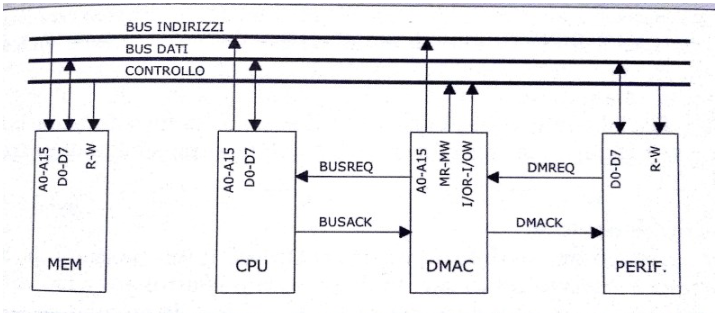

Vediamo le operazioni: 
+ l'interfaccia richiede il servzio DMA attraverso DMAREQ;
+ DMAC richede alla CPU L'uso del bus tramite BUSREQ;
+ la CPU concede il bus al DMAC (BUSACK), fintanto che il DMAC non ha finito di usare il bus (finché BUSREQ asserito);
+ il DMAC mette l'indirizzo sul bus indirizi, attiva MR e IOW, o MW e IOR;
+ La periferica legge/scrive sul bus dati il dato da trasferire;
+ finito il trasferimento, DMAC disattiva BUSREQ e la CPU riprende il controllo del bus e disattiva BUSACK.

Come è fatto un DMA? L'architettura prevede un contatore del numero di caratteri/parole da trasferire, un puntatore (registro indirizzo) alla posizione dove andrà scritto/letto il dato in memoria, un registro di comando con il tipo di trasferimento e un registro di stato.
E' prevista una fase di programmazione del DMA, in cui si settano i registri del DMA.
Il trasferimento puù essere: 

+ singolo: il DMA trasferisce un singolo carattere
+ a blocchi: trasferisce tutte le parole indicate dal contatore e al termine del trasferimento viene generata un'interruzione.

Facciamo una precisione sulle **interruzioni**. Possono essere:
+ asincrone: generate da periferiche esterne (viste finora);
+ sincrone (trap): generate da istruzioni, dovute a:
  + **errori** che avvengono nell'esecuzione di un'istruzione (es. divisione per 0) e sono dette eccezioni;
  + una **chiamata esplicita** con una istruzione specifica (es. INT 21H)
  
Le interruzioni sono molto importanti per i **Sistemi Operativi**, che sono per l'appunto **guidati** dalle interruzioni (interrupt driven).

## Introduzione ai Sistemi Operativi

Un sistema operativo è un programma che agisce da intermediario tra l'utente e l'hardware. Il suo scopo è quello di fornire un'interfaccia semplice e unificata per l'utente, nascondendo i dettagli dell'hardware. Inoltre, il sistema operativo deve gestire le risorse hardware in modo da ottimizzare l'uso delle risorse e garantire l'equità nell'accesso alle risorse.
Un sistema operativo deve rendere conveniente l'uso del calclatore, che può essere diviso in 4 componenti:

  + **Hardware** che fornisce i componenti di base per l'elaborazione dei dati:
    + CPU
    + memoria
    + dispositivi di I/O
    + bus
  + **sistema operativo** che controlla e coordina l'uso dell'hardware tra i vari programmi e utenti
  + **programmi applicativi** che definiscono le modalità di utilizzo del calcolatore da parte dell'utente (es. word processor, web browser, ecc.)
  + **utenti** che interagiscono con il calcolatore attraverso i programmi applicativi

Non esiste una definizione univoca di sistema operativo, ma possiamo definirlo come un allocatore di risorse, dato che gestisce le risorse del calcolatore e decide tra richieste in conflitto per un uso efficiente e giusto di esse. Inoltre, è un programma di controllo, in quanto controlla l'esecuzione dei programmi per evitare errori e usi impropri delle risorse. <br>
*Il programma che è sempre in esecuzione sul calcolatore* è il **kernel del SO**. Il kernel è il primo programma che viene eseguito quando si accende il calcolatore, e rimane in esecuzione fino allo spegnimento. Si occupa di tradurre i comandi immessi dagli utenti in modo da renderli leggibile dal computer... è un ponte tra software applicativo e hardware del sistema. Tutto ciò che non è il kernel è o un programma di sistema o un programma applicativo.

All'avvio (o al reboot) del calcolatore viene eseguito il programma di **bootstrap**, che è tipicamente memorizzato su una ROM (o EEPROM) noto come **firmware** e si occupa di inizializzare e controllare tutti gli aspetti del sistema e di caricare (e avviare) il kernel sulla RAM. In caso di fallimento, il sistema non è utilizzabile e bisogna intervenire manualmente.

### Organizzazione di un calcolatore

Nel calcolatore sono presenti:
+ una o più CPU e **controllori di dispositivi** di I/O connessi tramite bus che fornisce accesso a una memoria condivisa
+ esecuzione concorrente delle CPU e dei dispositivi che competono per l'uso della memoria


Ogni controllore di dispositivo si occupa di un tipo di dispositivo (es. stampante, disco, ecc.) e ha un buffer di memoria dedicato. La CPU sposta i dati dalla memoria al buffre e viceversa, mentre la periferica comunica col buffer del controllore. Il controllore di dispositivi informa la CPU che ha finito la sua operazione causando una interruzione.

### Gestione delle interruzioni

Il sistema operativo preserva lo stato della CPU memorizzando il contenuto dei registri e del PC. Deve anche determinare che interruzione è avvenuta:

+ **polling**: il SO interroga ciclicamente tutti i dispositivi per vedere se hanno generato un'interruzione. Il polling è inefficiente, in quanto la CPU spreca tempo a controllare i dispositivi che non hanno generato interruzioni.
+ **vectored interrupt system**: già visto.

le varie interruzioni hanno routine di servizio diverse. Non possono essere gestite tutte nello stesso modo!

### Architettura degli elaboratori

Due distinzioni:

+ sistemi **monoprocesosre**: un solo processore per l'esecuzione dei programmi utente. Possono avere altri processori dedicati, ma indipendenti dal SO (es. controller del disco)
+ sistemi **multiprocessore**: più unità di elaborazione strettamente connesse che condividono le risorse (bus, clock, memoria e periferiche). Questa architettura è più veloce, affidabile (il guasto di un processore non blocca il sistema) e più economico in proporzione al lavoro svolto, visto che le periferiche sono condivise. Tuttavia, è più difficile da progettare e richiede un SO più complesso.

I sistemi multiprocessore sono di due tipi: **asimmetrici** e **simmetrici**. I sistemi asimmetrici hanno un processore principale (master) che si occupa di gestire il sistema operativo, mentre gli altri processori (slave) eseguono i programmi utente. I sistemi simmetrici hanno più processori che eseguono il SO e i programmi utente. I sistemi simmetrici sono più complessi da progettare, ma sono più affidabili, veloci e scalabili. <br>

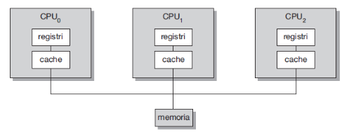

Di recente si tende a avere più **core** (unità di elaborazione) all'interno dello stesso circuito integrato e questo permette di risparmiare energia e di avere un sistema più veloce.

### Struttura della memoria

La memoria principale è la memoria a cui la CPU può accedere direttamente; la memoria secondaria può essere vista come un'estensione della memoria primaria, solo che ha il grande vantaggio di essere non volatile e di avere grandi dimensioni. La memoria secondaria è tipicamente costituita da dei dischi magnetici o da ssd.

I sistemi di memorizzazione sono organizzati in una gerarchia, secondo tre aspetti:

+ velocità: più è vicina alla CPU, più è veloce
+ costo: più è vicina alla CPU, più è costosa
+ volatilità
  
#### Caching

Il **caching** è una tecnica usata a tutti i livelli della gerarchia e consiste nel copiare temporaneamente l'informazione in uso da un un dispositivo di memorizzazione lento a uno più veloce. <br>
L'informazione viene prima cercata nella memoria veloce: se è presente, viene usata; altrimenti, viene cercata nella memoria lenta e copiata nella memoria veloce. Per la gestione della cache si usano algoritmi di rimpiazzamento, che decidono quale informazione rimuovere dalla memoria veloce per fare spazio a quella nuova.

In ambienti **multitasking** dobbiamo stare attenti a usare il valore più recente della variabile, in quanto potrebbe essere stato modificato da un altro processo. Per questo motivo, la cache deve essere **coerente**. In caso di sistemi **multiprocessore**, la cache delle varie CPU devono avere gli stessi valori. <br>

### Struttura del SO

Una cosa necessaria nella struttura di un sistema operativo è la **multiprogrammazione** che aumenta l'efficienza. Gestisce lavori (jobs; codice e dati) diversi, in modo che la CPU abbia sempre qualcosa da fare. Un sottoinsieme di questi lavori presenti sul sistema è tenuto in memoria e un lavoro è selezionato da questo sottoinsieme attraverso il **job scheduling**: quando un lavoro deve aspettare un evento, il sistema operativo ne commuta un altro.

**Timesharing (multitasking)**: la CPU cambia job così frequentemente che l'utente può ineragire con il job mentre è in esecuzione, dando vita all'**interactive computing**. Questo è possibile se il tempo di risposta è inferiore a un secondo.
Ogni utente ha almento un programma in esecuzione in memoria e quindi si hanno dei processi. Se molti job sono pronti all'esecuzione allo stesso tempo, vanno pianificati attraverso il **CPU scheduling**. Se non c'è abbastanza memoria per tenere tutti i processi, lo swapping li sposta dentro o fuori dalla memoria. In alternativa, la memoria virtuale permette l'esecuzione di processi non completamente salvati in memoria.

## Sistemi Operativi 

Come abbiamo detto, il sistema operativo è guidato dalle interruzioni che, come abbimo visto, possono generare problemi come: loop infiniti, processi che si modificano a vicenda ecc...
Il **dual-mode** permette al SO di proteggersi e proteggere altri componenti del sistema. il sistema si può trovare in user-mode o kernel-mode:

+ **user-mode**: si sta eseguendo codice dell'utente. Non è considerato molto sicura come modalità;
+ **kernel-mode**: è in esecuzione il kernel e quindi il sistema operativo

la modalità è indicata da un bit di stato fornito dall'hardware e permette quindi di distinguere quando il sistema sta eseguendo codice utente o codice del kernel. Quando il sistema è in kernel-mode, può eseguire le cosiddette istruzioni **privilegiate** (es. istruzioni di I/O), non disponibili in user-mode. Il bit di stato (bit di modo) è cambiato dalle chiamate di sistema:

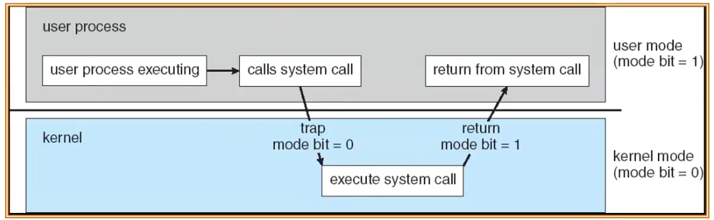

Questo risolve il problema per alcune istruzioni sbagliati, però non riesce a risolvere il problema del loop infinito, perché il sistema operativo rimane in attesa. Per questo motivo introduciamo i **timer**: Il SO usa i timer per prevenire i loop infiniti e i processi che si impossessano delle risorse del calcolatore senza rilasciarle. Il timer è un dispositivo hardware che genera una interrupt a intervalli predefiniti; il SO decrementa un contatore e, al raggiungimento dello zero genera un'interrupt, che riporta il sistema in modalità kernel. Il contatore viene impostato dal sistema operativo prima di schedulare un proesso.

### Gestione dei processi 

Un processo è un programma in esecuzione. E' un unità di lavoro (composta da più job) nel sistema di calcolo. Un programma è un'entità passiva, mentre il processo è attivo: ha bisogno di risorse per svolgere il suo lavoro. La terminazione di un processo implica che il sistema operativo si riappropri delle risorse che sono state usate. <br>
I processi possono essere: 

+ **single-thread**: Il processo esegue le istruzioni in modo sequenziale. Ha un PC che specifica l'indirizzo della prossima istruzione da eseguire. 
+ **multi-thread**: ha un PC per thread e le istruzioni sono eseguite in modo concorrente: all'interno dello stesso processo ho più sequenza da eseguire 

Tipicamente il sistema ha molti processi in eseczione su una o più CPU, alcuni dei quali possono essere degli utenti e altri del sistema operativo. La concorrenza dei processi è ottenuta facendo **multiplexing** della/delle CPU tra i processi/thread.

Il sistema operativo è responsabile di:

+ creare e cancellare i processi utente o del sistema operativo stesso
+ sospendere e riprendere i processi 
+ fornire meccanismi di sincronizzazione e comunicazione tra i processi (spesso i processi hanno bisogno di risultati di altri processi)
+ fornire meccanismi di gestione dello stallo (*deadlock*)

### Gestione della memoria

Il sistema operativo deve gestire tutti i dati in memoria prima e dopo l'esecuzione di un processo. Tutte le istruzioni devono essere in memoria per poter essere eseguite. Il SO deve:

+ tenere traccia delle parti di memoria in uso e di quelle libere
+ decidere quali processi (o sue parti) e dati muovere dentro e fuori la memoria primaria (swapping)
+ allocare e deallocare la memoria quando necessario

Anche la memoria secondaria deve essere gestita! Il SO fonisce una vista logica e uniforme della memoria secondaria, astraendo le proprietà fisiche in unità logiche  di memorizzazione, i file: blocchi di byte che possono essere letti e scritti in maniera diretta e in tempo costante. Questo metodo rende molto più semplice l'utilizzo della memoria da parte dell'utente medio. Il sistema operativo gestisce il **File-system**, astraendo il conenuto in files, solitamente organizzati in directories e controllando gli accessi a tali cartelle per determinare chi può usare cosa. Il SO deve:

+ creare e cancellare files e directory;
+ creare e cancellare copie di backup memorizzabili (non volatili) dei files;
+ mappare files in memoria primaria
+ fornire delle primitive per manipolare files e directories

Linux vede tutto come un file. 

Le memorie di massa (dischi) sono usati per memorizzre dati che non entrano in memoria primaria o dati che devono essere memorizzati per lungo tempo. La gestione di questi dispositivi è importantissima, perché sono molto più lenti della memoria primaria e quindi è necessario ottimizzare l'accesso ai dati. Il SO si occupa di gestire lo spazio libero, allocare in memoria file e directories e di gestire lo scheduling del disco, ovvero di decidere come le letture si succedono in modo da ridurre al massimo i tempi di attesa.

### Sottosistema di I/O

Il sistema operativo deve nascondere le peculiarità dei dispositivi hardware all'utente. Una parte del sistema operativo, detta sottosistema di I/O si occupa di gestire la memoria per I/O:

+ buffering (memorizzare i dati temporaneamente mentre vengono trasferiti)
+ caching (memorizzare i dati in memorie più veloci per un uso futuro)
+ spooling (memorizzare i dati verso device lenti di I/O, come le stampanti)

mette a disposizione un'interfaccia di uso generale tra device e driver

### Protezione e sicurezza

Il sistema operativo deve garantire:
+ **Protezione**: ogni meccanismo per controllare l'accesso dei processi/utenti a risorse definite dal sistema operativo
+ **sicurezza**: difera del sistema contro attacchi interni ed esterni

I sistemi distinguono gli utenti per determinare chi può fare cosa. Gli utenti sono identificati (user ID) da un nome e un numero associato. Lo user ID è associato a tutt i file e le directory a cui un utente può accedere e a tutti i processi che l'utente può eseguire. Il group ID permette di identificare un gruppo di utenti e può essere usato per controllare l'accesso risorse a livello di gruppo (compito più facile per il sistemista).

### Ambienti di elaborazione

Esistono vari tipi di configurazione per un ambiente di elaborazione:
+ Personal Computer 
+ Client-Server: il server risponde alle richieste dei client e può fornire un'interfaccia per richiedere servizi, come database (**compute-server**) o un'interfaccia per memorizzare e accedere ai file (**file-server**)<br><br>
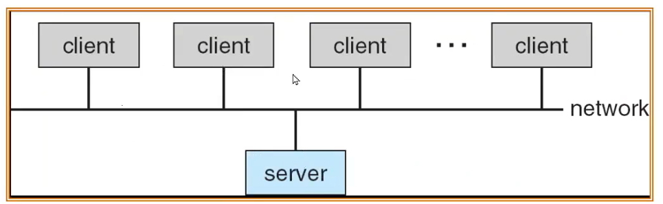<br><br>
+  peer-to-peer (P2P): non vi è distinzione tra client e server e ogni host può fornire servizi o richiederli. I nodi sono detti peers e fanno richieste in broadcast (su tutta la rete) per un servizio e risponde chi è in grado di fornirlo (**discovery** protocol)

## Struttura dei Sistemi Operativi

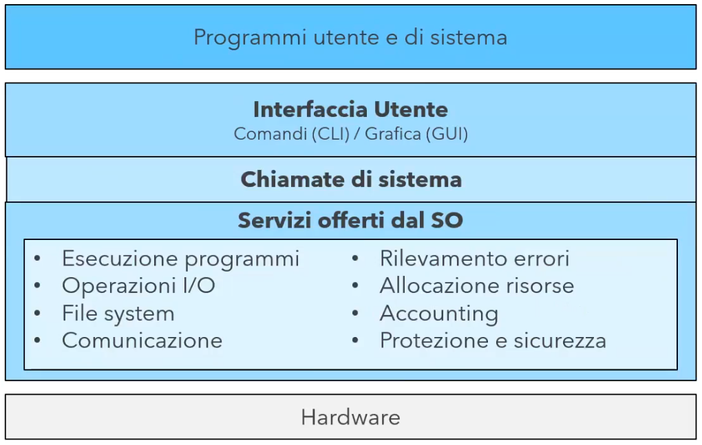

### Servizi

Il sistema operativo ha il compito di rendere utilizzabile un calcolatore e, per farlo, mette a disposizione dei servizi per l'utente:

+ **interfaccia utente**: Quasi tutti i sistemi ne sono dotati. Ne esistono di due tipi:
  + command-line interface (CLI): l'utente interagisce con il sistema operativo tramite comandi testuali
  + graphical user interface (GUI): l'utente interagisce con il sistema operativo tramite icone e menu. Basate su tastiera, mouse e desktop
+ **Esecuzione dei programmi**
+ **Operazioni di I/O**: Un programma in esecuzione deve poter interagire con dispositivi di I/O
+ **Accesso al file-system**: I progarmmi hanno bisogno di memorizzare dati in modo permanente
+ **Comunicazione**: I processi devono poter comunicare tra loro attraverso memoria condivisa o invio di messaggi
+ **Rilevazione degli errori**: Il sistema operativo deve essere in grado di rilevare e correggere errori hardware e software

Per un uso efficiente e sicuro del sistema stesso, le risorse vengono condivise da più utenti e processi. Il sistema operativo mette a disposizione servizi di:

+ **allocazione risorse**: per mettere a disposizione a tutti gli utenti delle risorse
+ **Accounting/logging**: per tenere traccia di quali utenti usano le risorse 
+ **Protezione e sicurezza**: assicura che tutti gli accessi al sistema siano controllati e autorizzati e il sistema sia sicuro da attacchi esterni.

### Interfacce utene del SO

#### CLI

Permette l'inserimento diretto dei comandi. alcune volte è implementato nel kernel, altre volte nei programmi di sistema. Una CLI è basata su una shell, una collezione di comandi eseguibili da quella interfaccia. Un sistema può implementare anche più shells. Alcune volte i comandi sono built-in nell'interprete dei comandi, altre volte sono solo nomi dei programmi. Nel secondo caso, aggiungere nuovi comandi non richiedere di modificare la shell.

#### GUI

Interfaccia user-firendly che rappresenta file, programmi, azioni ecc. con delle icone e permette di interagire con il sistema operativo tramite mouse e tastiera. Un sistema può includere sia GUI che CLI.

### Chiamate di sistema

Le chiamate di sistema rappresentano un'interfaccia di programmazione verso i servizi offerti dal SO. Sono tipicamente scritte in C/C++ e vengono usate dai programmi attraverso delle **API** (Application Program Interface), che forniscono un'astrazione di alto livello verso le funzionalità offerte dal sistema operativo. Tra le API più famose troviamo Win32 API per Windows e Java API per la Java Virtual Machine (JVM) che sono a un livello di astrazione maggiore. 

+ Sequenza di chiamate di sistema per copiare il contenuto di un file su un altro file <br><br> 
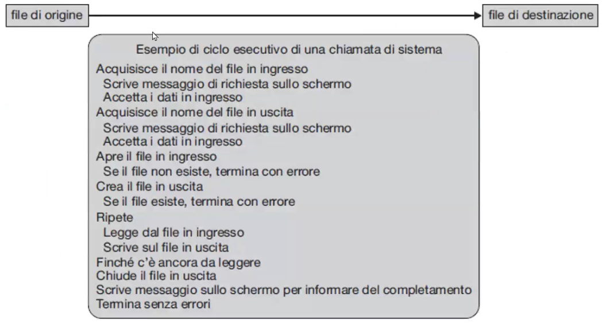

```
API := insieme di definizioni e protocolli per la creazione e l'integrazione di applicazioni software
```

Tutto ciò che è esterno alla computazione del programma (manipolazione dei dati in memoria ecc.) necessita di una chiamata di sistema.

Tipicamente, ogni chiamata di sistema è identificata da un ID e l'interfaccia per le chiamate di sistema mantiene una tabella indicizzata in base a questi numeri. <br>
L'interfaccia invoca la chiamata di sistema a livello di kernel e ritorna lo stato della chiamata e ogni valore di ritorno. <br>
Il chiamante non ha interesse a sapere come viene effettuata la chiamata di sistema, deve solo seguire la API e capire cosa il SO produrrà in risposta alla chiamata (astrazione).

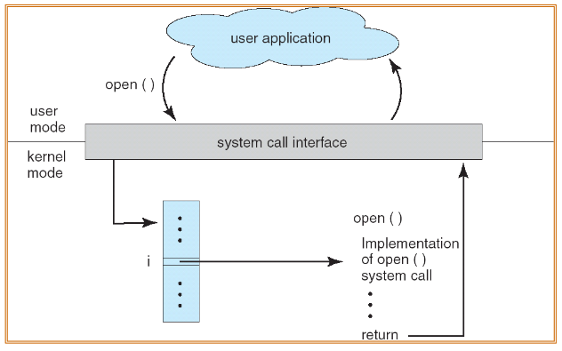

#### Linux System Call

Le chaimate di sistema di Linux vengono fatte attraverso l'istruzione INT 80h (vuol dire che all'indirizzo 80h avrò la chiamata alla procedura che gestisce le chiamate di sistema)(interrupt sincrona chiamata esplicitamente) e il registro EAX del processore contiene il numero della chiamata di sistema da eseguire. INT 80h passa dalla modalità utente a quella kernel: <br>
+ Il kernel della procedura associata all'interruzioe 80h (ISR) può controllare se la chiamata è valida e usando una tabella interna al kernel può chiamare la funzione associata alla chiamata di sistema indicata nel registro EAX.
```assembly
MOV EAX, 04h      ;write syscall
MOV EBX, 1        ;standard output
MOV ECX, buffer   ;puntatore al buffer
MOV EDX, count    ;numero di caratteri del buffer da stampare
INT 80h           ;esegue syscall
```

### Passaggio dei parametri alla chiamata di sistema

Esistono tre metodi per passare i parametri alla chiamata di sistema. Il più semplice, quello riportato sopra, usa i registri della CPU e, come abbiamo visto, è quello che usa linux. Questo metodo però limita il numero di parametri che possiamo passare al numero di registri disponibili. Un altro metodo prevede di memorizzare i parametri in un blocco o tabella di memoria e l'indirizzo del blocco viene passato come parametro in un registro della CPU (usato da Solaris). 

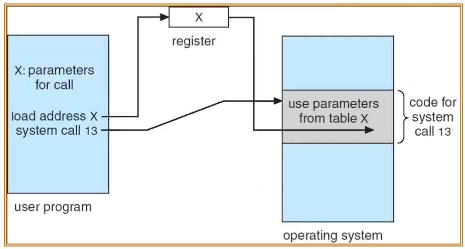

Infine possiamo passare i parametri usando lo stack. <br>
Gli ultimi due metodi non limitano il numero e la lunghezza dei parametri passati.

### Tipi di chiamate di sistema

+ **Controllo dei processi**
+ **Gestione dei File**
+ **Gestione dei dispositivi**
+ **Comunicazioni**

### Programmi di sistema

I programmi di sistema sono forniti insieme al sistema operativo e mettono a disposizione un ambiente per lo sviluppo fi programmi e per la loro esecuzione, Possono essere divisi in programmi per: 

+ la manipolazione di file;
+ ottenere informazioni sullo stato: 
  + chiedere informazioni al sistema come: data e ora, quantità di memoria disponibile..
  + fornire informazioni dettagliate per l'analisi delle performance
  
  tipicamente stampano su terminale
+ la modifica di file
+ il supporto di linguaggi di programmazione
+ il caricamento di programmi e loro esecuzione
+ le comunicazioni
+ programmi applicatvi 

Alcuni sono semplicemente delle interfacce per le chiamate di sistema; altri sono considerevolmente più complessi.

### Progettazione e implementazione di Sistemi Operativi

Progettare e implementare un sistema operativo è complicato. La struttura interna può variare moltissimo tra un sistema operativo e l'altro. La prima cosa da fare è definire gli obiettivi (goals) e le caratteristiche del sistema. Dobbiamo ricordare che un sistema operativo è strettamente legato all'hardware su cui dovrà girare

Un principio importante è quello di separare i criteri o politiche, che decidono cosa sarà fatto, dai meccanismi, che invece determinano come qualcosa verrà implementato.

#### Struttura monolitica (macrokernel)

Approccio più semplice. Il kernel è un unico file binario, un singolo programma, con un unico spazio di indirizzamento e nella fase di boot viene caricato e messo in esecuzione. Questo sistema comporta varie problematiche, tra cui il fatto che i device driver sono integrati nel kernel ed è quindi difficile supportare nuovi device...è necessario un riavvio ogni volta che un nuovo dispositivo viene aggiunto. Unix e linux usavano questa struttura

##### Struttura unix 

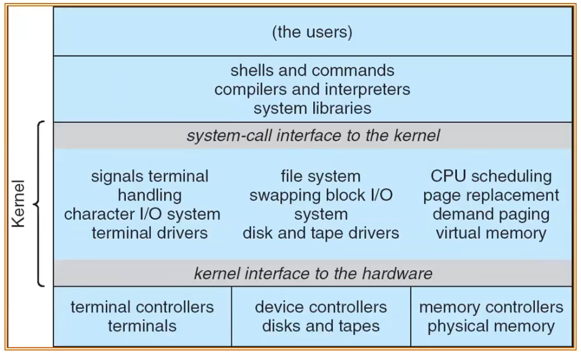

#### Approccio stratificato

Il sistema operativo viene diviso in un numero N di strati (layer), ognuno costruito sulla base degli strati inferiori. Lo strato più basso identifica l'hardware, mentre la user interface identifica lo strato più alto. Ogni strato usa funzioni e servizi dei soli strati inferiori. <br>
Questo tipo di struttura è facile da verificare e testare, ma difficile da progettare, in quanto non è banale definire gli strati. Inoltre si introduce un'inefficienza dovuta all'attraversamento dei vari strati in una chiamata.

#### Struttura a microkernel

Il kernel si occupa solo di: gestire i processi, gestire la memoria e gestire la comunicazione tra processi. Tutto il resto viene delegato alla user-mode.

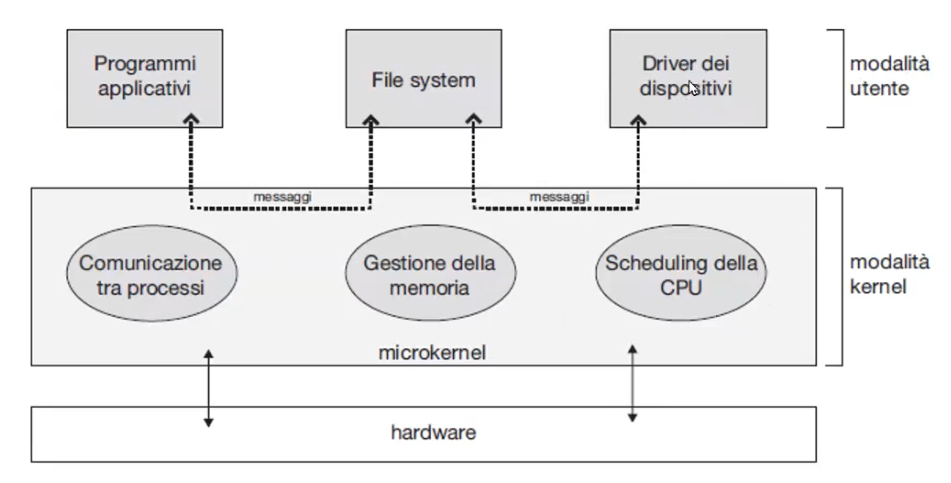

Questa soluzione porta una serie di benefici:

+ più facile da estendere
+ più facile portare il sistema operativo su nuove architetture hardware
+ più affidabile (meno codice in esecuzione in kernel-mode)
+ più sicuro

> *un fallimento in modalità utente è più facile da gestire* 

La maggior comunicazione tra spazio utente e kernel, comporta però una diminuzione delle performance

##### Struttura MacOs

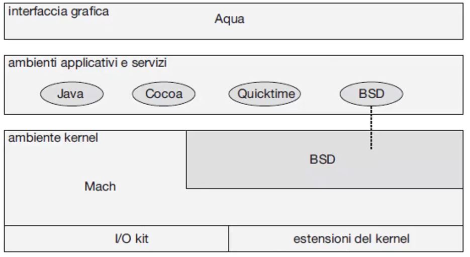

Questa struttra ha aspetti microkernel, però è detto a kernel ibrido.

#### Moduli

La maggior parte dei sistemi operativi moderni implementano una struttura modulare, con i così detti moduli kernel. E' un struttura che usa un approccio object-oriented in cui ogni componente base è separato. Ogni modulo comunica con gli altri moduli attraverso interfacce ben definite e viene caricato in base alle necessità del kernel. Quest'ultima caratteristica lo rende molto più flessibile della struttura stratificata

##### Struttura modulare di Solaris

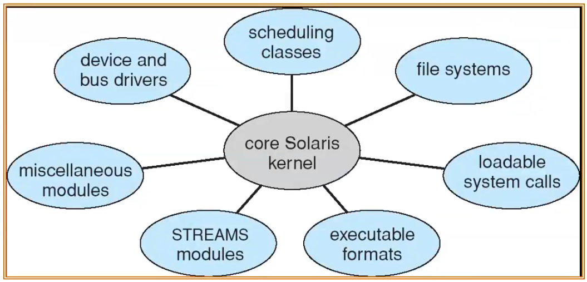

### Macchine Virtuali (VM)

Una macchina virtuale ha l'obiettivo di simulare una macchina fisica. **Fornisce una interfaccia identica all'hardware sottostante**. <br>
Il sistema operativo crea l'illusione di disporre di più macchina, ognuna in esecuzione sul suo processo e con al propria memoria (virtuale).<br>
Lo scheduling della CPU crea l'illusione de ogni VM abbia il proprio processore dedicato. Il file-system può fornire uno spazio di memorizzazione per ogni macchina virtuale. <br>
Sono molto utilizzate nei datacenter per sfruttare al meglio le risorse di calcolo 

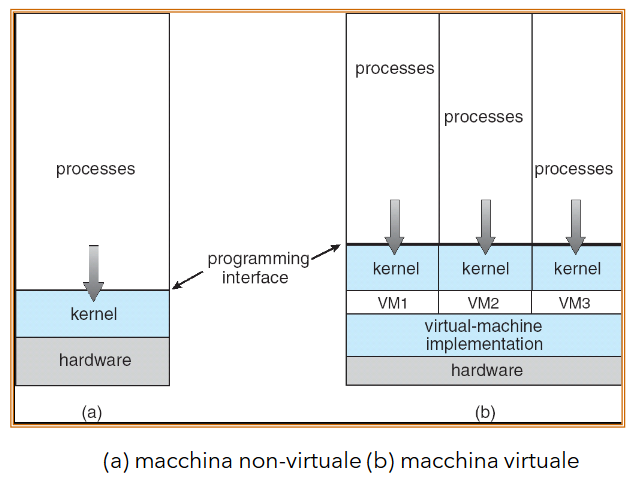

Un pregio delle macchine virtuali è che forniscono la completa protezione delle risorse del sistema, infatti ogni macchina virtuale è isolata dalle altre. Inoltre, è possibile eseguire più sistemi operativi contemporaneamente sulla stessa macchina fisica e questo permette di fare ricerca e sviluppo facilmente.<br>
Un difetto è che la macchina virtuale richiede un grande sforzo per fornire una copia esatta dell'hardware sottostante. Un altro problema è che il codice normalmente eseguito in modalità kernel, sulle macchine virtuali viene eseguito in modalità utente

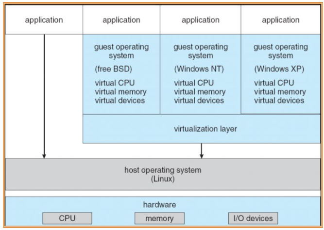
La virtualizzazione è fornita all'interno delle applicazioni, che sono eseguite in modalità utente.

### Container applicativi

Il problema delle macchine virtuali è che ogni VM in esecuzione su un host implica un uso di memoria e CPU per il kernel e per i processi del SO. Questo limita il numero di macchine virtuali che possono essere eseguite su un host. Un altro problema è il tempo impiegato da una VM per avviarsi. Molto spesso, tralaltro, sulla stessa macchina operano macchine virtuali identiche. 

Per risolvere il problema si implementa un solo kernel che raggruppa i processi in dei "container", ad ognuno dei quali associamo:

+ un file-system
+ un'interfaccia di rete virtuale 

il kernel isola i vari processi che fanno parte del container dagli altri processi degli altri container. Vediamo i vantaggi:

+ minor occupazione di memoria CPU e overhead di virtualizzazione 
+ Avvio di un nuovo container molto veloce
+ più facile installare un container

### Macchina Virtuale Java (JVM)

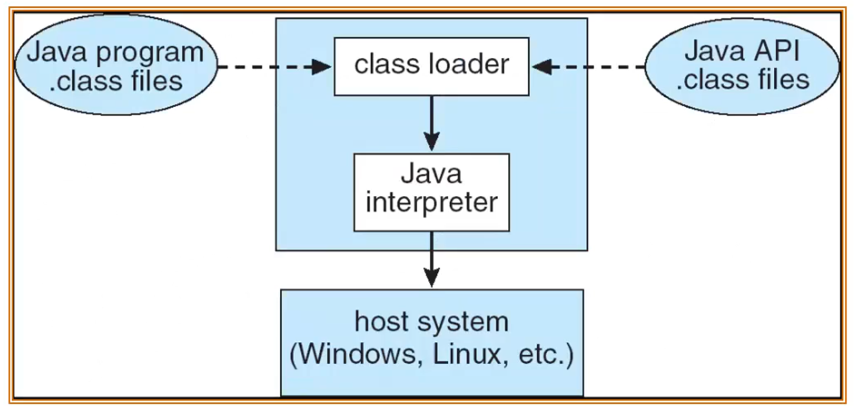

Permette di eseguire codice in un linguaggio macchina di una macchina non fisica, ma astratta (emulata da una macchina fisica nella quale è in esecuzione). La JVM ha un proprio linguaggio macchina (bytecode) eseguito su più SO. <br>
Può eseguire applicazioni java su host system diversi, perché vengono compilate in linguaggio macchina. Questa caratteristica rende java perfetto per applicazioni multipiattaforma.


## I processi

Un **processo** è un programma in esecuzione. E' un'entità attiva che ha bisogno di risorse per svolgere il suo lavoro. L'esecuzione del programma deve procedere in modo sequenziale e sfruttano le chiamate di sistema per interagire con il sistema operativo. <br>

Un processo include:

+ **program counter**;
+ **sezione dati**;
+ **stack**;

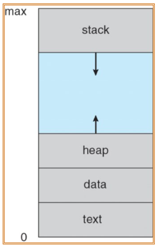

Un sistema operativo esegue più processi alla volta e ha quindi il compito di astrarre la gestione della memoria in modo che ogni processo veda il proprio spazio di memroizzazione senza interferenze da parte degli altri processi.

Un processo può trovarsi in uno dei segueni **stati**:

+ **new**: il processo è in fase di creazione
+ **ready**: il processo è pronto per essere eseguito
+ **running**: il processo è in esecuzione
+ **waiting**: il processo è in attesa di un evento (es. I/O)
+ **terminated**: il processo ha terminato l'esecuzione

e passa da uno stato all'altro secondo il seguente grafico:
  
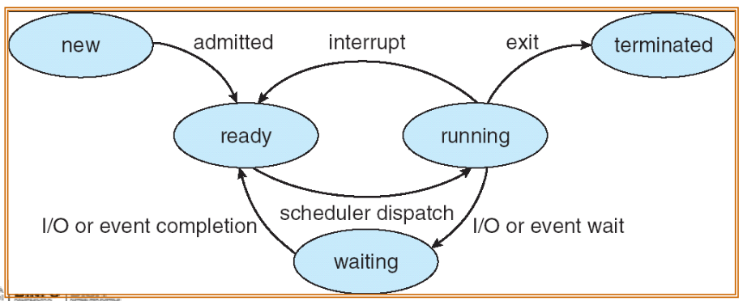

Le informazioni associate (caratteristiche) a un processo vengono memorizzate in una struttura dati del kernel detta **Process Control Block (PCB)**. Il PCB contiene:

+ Stato del processo;
+ process number (pid);
+ program counter (PC): che si aggiorna quando si verificano delle interrupt e il processo passa dallo stato di running a quello di ready (o waiting);
+ registri della CPU: salvati quando il processo passa dallo stato di running a quello di ready;
+ informazioni per lo scheduling della CPU;
+ informazioni per la gestione della memoria: zona di memoria associata al processo;
+ informazioni di accounting: quante risorse ha utilizzato; 
+ informazioni di I/O: quali dispositivi di I/O sono assegnati al processo

Vediamo come la CPU passa da un processo all'altro:

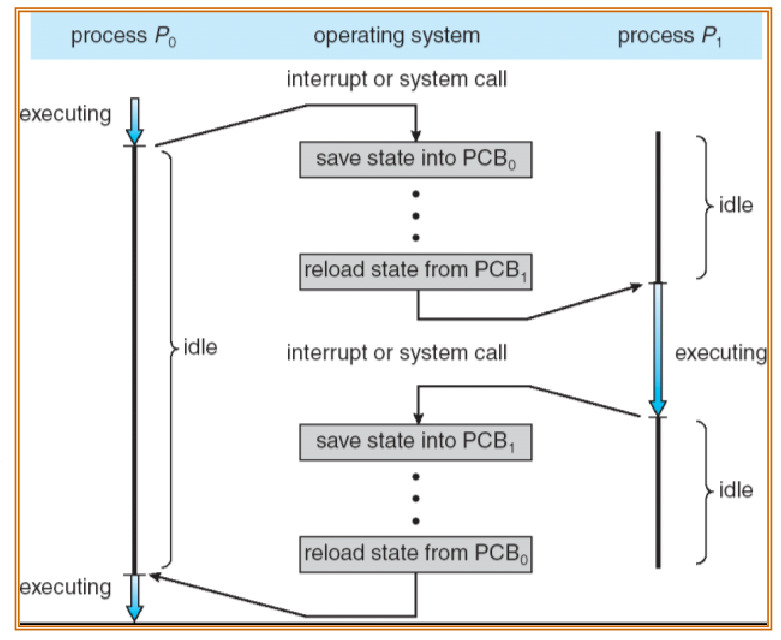

I processi vengono divisi in code a seconda del loro stato e possono migrare tra le varie cose. Generalmente esistono tre code principali:

+ **ready queue**: contiene tutti i processi pronti e in attesa di essere eseguiti
+ **device queue**: contiene i processi in attesa di un dispositivo di I/O
+ **job queue**: contiene tutti i processi nel sistema

I processi entrano nella ready queue, vanno nella CPU e poi possono uscire oppure andare in una coda di I/O. Allo scadere del tempo di CPU può tornare nello stato di ready. Un processo può anche generare un nuovo processo figlio (*fork a child*), eseguire il processo e rientrare nella ready queue.

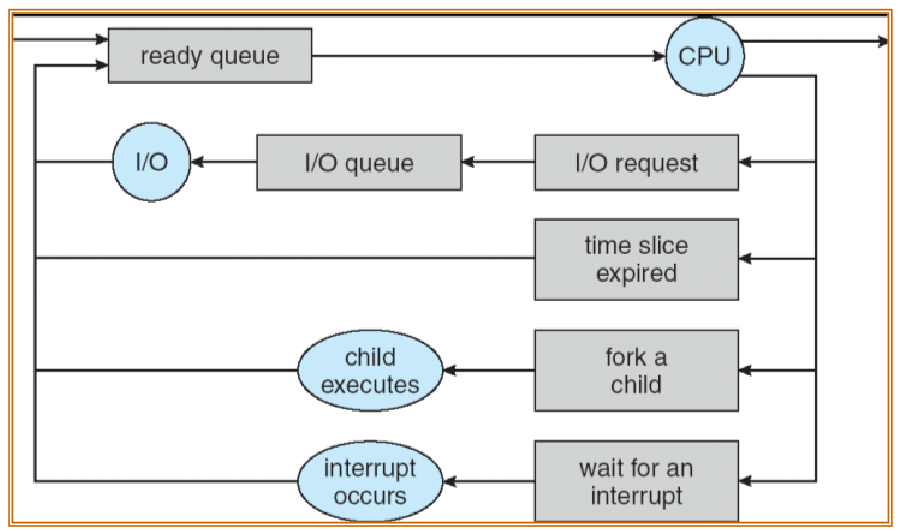

### Schedulers

I **schedulers** sono i moduli del sistema operativo che si occupano di decidere quali processi far eseguire alla CPU. Ne esistono di tre tipi:

+ **long-term scheduler**: decide quali processi vanno dalla job queue alla ready queue. Questo scheduler è molto importante, perché determina il grado di multiprogrammazione del sistema. Se il grado di multiprogrammazione è troppo basso, la CPU è spesso inattiva; se è troppo alto, i processi vanno in attesa di CPU e si ha un aumento del tempo di risposta. Il long-term scheduler viene eseguito molto raramente (secondi, minuti, ore) e viene chiamato anche **job scheduler** o **admission scheduler**.
+ **short-term scheduler**: decide quali processi vanno dalla ready queue alla CPU. Questo scheduler viene eseguito molto spesso (decine di volte al secondo) e viene chiamato anche **CPU scheduler**.
+ **medium-term scheduler**: decide quali processi vanno dalla memoria secondaria alla memoria primaria. Questo scheduler viene eseguito molto raramente (minuti, ore) e viene chiamato anche **swapper**.

I processi possono essere divisi in due categorie:

+ **a prevalenza di I/O**: passa più tempo a fare I/O che a eseguire istruzioni (processi interattivi);
+ **a prevalenza di CPU**: passa più tempo a eseguire istruzioni che a fare I/O.

Quando la CPU viene assegnata ad un altro processo, il sistema deve salvare lo stato del processo e caricare lo stato del nuovo processo (lo stato del processo è salvato nel PCB). Questa operazione è detta **context switch** e comporta un calo delle prestazioni; il sistema non fa nessun lavoro utile alla computazione mentre effettua il cambio di contesto, quindi questo calo delle prestazioni va ridotto al minimo, in modo da massimizzare l'efficacia della CPU. <br>
Il tempo impiegato per il context switch è determinato dal supporto hardware.

### Creazione e terminazione dei processi

Come visto nello scheduling di un processo, un processo (parent) può generare un processo figlio (child), che a sua volta crea altri processi, formando un albero di processi. Il sistema operativo crea un processo iniziale (init) che crea tutti gli altri processi. <br> 
Un processo figlio può condividere alcune risorse con il processo padre, come la memoria, i file, i dispositivi di I/O ecc. Si hanno 3 possibilità:

+ genitore e figlio condividono tutte le risorse
+ genitore e figlio condividono alcune risorse
+ genitore e figlio non condividono nessuna risorsa

Per quanto riguarda l'esecuzione, un processo padre e un processo figlio possono essere eseguito in maniere concorrente, oppure un processo padre può essere messo in stato di *wait* finché il processo figlio non termina. <br>

per quanto riguarda la l'allocazione in memoria, un processo figlio può essere creato come un duplicato del processo padre, oppure creato con un programma caricato dentro di esso. <br>

**UNIX** usa il primo approccio: La chiamata di sistema **fork** crea un nuovo processo duplicato del padre, l'unica cosa che cambia tra padre e figlio è il valore ritornato da fork: 0 per il figlio e il pid del figlio per il padre. <br>
La chiamata di sistema **exec** viene usata dopo una fork sostituire il processo in memoria con il processo figlio. <br>

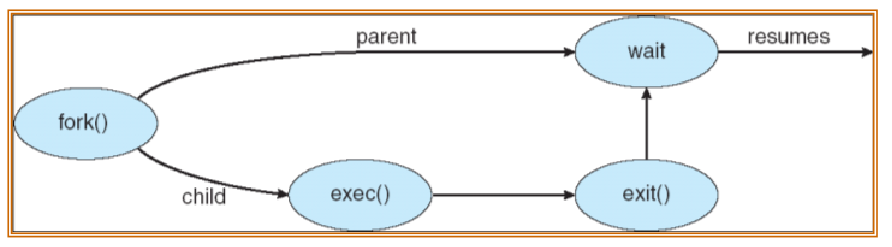

La chiamata di sistema **exit** termina il processo e restituisce il controllo al processo padre. La chiamata exit viene effettuata dal processo figlio al termine dell'esecuzione della sua ultima istruzione. Questa chiamata ha il compito di liberare le risorse del processo e di restituire lo stato di terminazione al processo padre, che lo riceve dalla wait. <br>

Un processo figlio può anche venir terminato direttamente dal processo padre, attraverso una chiamata di sistema **abort**. Questo si verifica se il compito del figlio non è più necessario o se il processo padre termina: alcuni sistemi operativi non permettono ai figli di continuare se il processo padre termina (*terminazione in cascata*); altri invece assegnano i figli al processo iniziale (init). <br>

Se un processo ha portato a termine la sua esecuzione, ma ha ancora un pid e un PCB associato, viene detto **zombie**. Il PCB viene tenuto in memoria finché il processo padre non fa una wait. Un eccessivo numero di processi zombie può essere problematico dal punto di vista della memoria.

I processi eseguiti da riga di comando hanno associato:

+ **stream di input**: da cui il processo legge i dati (sequenza indefinita di caratteri)
+ **strame di output**: su cui il processo scrive i dati
+ **strame di errori**: su cui il processo scrive i messaggi eventuali di errore

I processi si possono comporre connettendo lo stream di output di uno sullo stream di input di un altro, usando una **pipe**: 

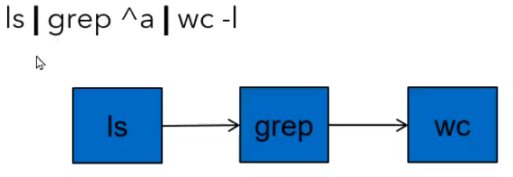

+ *grep* è un processo che cerca una stringa in un file e restituisce le righe che contengono la stringa cercata.
+ *wc* è un processo che conta il numero di righe, parole e caratteri di un file (in queto caso nello stream di output di *grep ^a*).

L'esecuzione dei processi in *Java* avviene attraverso il metodo *exec* della classe **RunTime**. In jav l'esezuzione diretta di nuovi processi limita la portabilità dell'applicazione; (es. potrei eseguire un processo di windows che non è presente su linux) è sempre meglio usare i **THREAD**, perché vengono eseguiti nella **JVM**, che è indipendente dal sistema operativo.

### Processi cooperativi e indipententi

Un processo è detto **indipendente** se non viene influenzato e non influenza l'esecuzione di altri processi. Un processo è detto **cooperativo** se può influenzare o essere influenzato dall'esecuzione di altri processi; i processo cooperano per un certo obiettivo. <br>
I processi cooperativi presentano dei vantaggi:

+ Condivizione delle informazioni;
+ velocizzazione delle elaborazioni: alcuni processi si occupano di cose diverse in parallelo a altri; 
+ modularità: processi diversi si occupano di cose diverse;
+ convenienza economica;
+ posso creare un sistema distribuito.

### InterProcess Communication (IPC)

Come già detto, i processi cooperativi hanno bisogno di comunicare tra loro. IPC è un meccanismo usati dai processi per lo scambio di dati, attraverso sue modelli princali:

+ (a) **memoria condivisa**: viene creata una zona di memoria condivisa tra più processi, che possono leggere e scrivere in essa. Questo metodo è molto veloce, ed è usata per scambiare grandi quantità di dati. Il problema di questo metodo è che un processo non sa quanto un altro ha scritto o letto sulla memoria condivisa, rendendo complicata la sincronizzazione. Esistono dei metodi per risolvere il problema: come il polling (poco efficiente)
+ (b) **scambio di messaggi**: metodo più lento, che permette di sincronizzare facilmente i processi. Mettiamo caso che A voglia scambiare un messaggio con B: A invia il messaggio al kernel sistema operativo, che ne fa una copia e lo memorizza in una coda di messaggi. B legge il messaggio dalla coda e lo elimina. Il problema di questo metodo è che il sistema operativo deve gestire la coda dei messaggi, che può diventare molto lunga. E' l'ideale per lo scambio di piccole quantità di dati.


IPC fornisce due operazione di base:

+ **send(message)**: invia un messaggio di grandezza fissa o variabile
+ **receive(message)**: riceve un messaggio di grandezza fissa o variabile

Se i processi P e Q vogliono comunicare, devono stabilire un canale di comunicazione tra loro e usare le operazioni sopra descritte per scambiare messaggi. <br>
Il canale di comunicazione può essere:

+ livello fisico (es. memoria condivisa, hardware bus)
+ livello logico (es. proprietà logiche)

#### Comunicazione diretta

I processi devono nominarsi esplicitamente all'interno delle funzioni (send(P, message), receive(Q, message)). In questo tipo di comunicazione, il canale è stabilito automaticamente tra due processi comunicanti con un collegamento; tra due coppie di processi può esiste un solo collegamento e può essere unidirezionale o bidirezionale. Questo metodo è un po' scomodo nel caso in cui un processo debba comunicare con più di un processo, perché deve creare un collegamento per ogni processo con cui vuole comunicare. 

#### Comunicazione indiretta

Questo metodo è molto più usato e permette di astrarre la comunicazione rta processi: I messaggi inviati da un processo sono diretti e vengono ricevuti da una porta (o mailbox), identificata con un numero univoco. I processi possono comunicare solo ce condividono una porta. <br>
Il collegamento viene stabilito solo se i processi condividono una porta; può essere associato a pià processi e una coppia può condividre più collegamenti. 

Le operazioni di una comunicazione indiretta sono: 

+ creare una porta
+ inviare e ricevere messaggi tramite una porta
+ distruggere una porta

Le primitive send e receive sono uguali a quelle della comunicazione diretta, solo che prendono in ingresso l'identificativo della porta. 

Ora mettiamo caso che tre processi: P1, P2, P3 condividano la porta A. P1 invia sulla porta A; P2 e P3 ricevono. Chi prende il messaggio? Per risolvere queste situazioni esistono varie tecniche:

+ Permettere che una porta possa essere associata al più a due processi (molto limitante)
+ Permettere che solo un processo alla volta possa ricevere sulla porta
+ Permettere che il sistema operativo scelga in modo arbitrario quale processo riceve il messaggio, al processo inviante viene notificato quale processo ha ricevuto il messaggio

#### Sincronizzazione 

L’invio/ricezione di messaggi può essere bloccante o
non bloccante
+ **Bloccante** è considerato **sincrono**
  + Invio bloccante: il processo viene bloccato fino a
che il messaggio non viene ricevuto
  + Ricezione bloccante: il processo viene bloccato
fino a che un messaggio è disponibile
+ **Non bloccante** è considerato **asincrono**
  + Invio non bloccante: il processo invia il
messaggio e continua
  + Ricezione non bloccante: il processo riceve un
messaggio valido o un messaggio nullo

#### Code di messaggi

Il sistema operativo ha il compito di gestire le code di messaggi. Ne esistono di due tipi:

+ **capacità zero**: Il processo inviante deve aspettare il processo ricevente...si devono incontrare
+ **capacità limitata**: La coda ha capacità limitata n e il processo inviante aspetta solo se la coda è piena 

## Threads

Il sistema operativo è in grado di eseguire processi single e multi-thread. I processi multi-thread, condividono il codice i dati (variabili globali) e i file, mentre hanno uno stack e dedicato e ognuno ha i propri registri. <br>

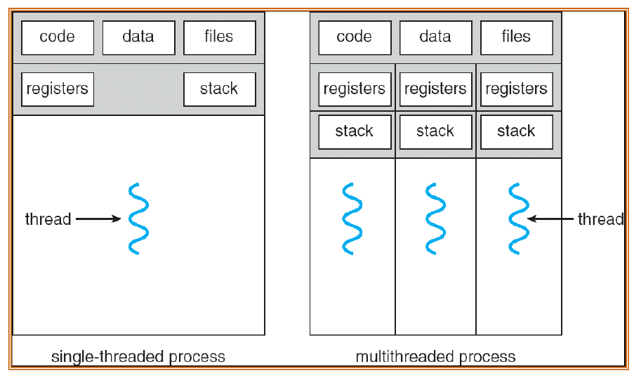

Usare i multi-thread invece dei processi a singolo thread, porta certi benefici: 

+ Diminuisce i tempi di risposta di una applicazione: durante un periodo di attesa, altre attività della applicazione possono essere svolte;
+ Condiviione delle risorse: tutti i thread accedono alla stessa area di memoria e ai file aperti dal processo;
+ Economia: creare un thread è più veloce che creare un processo, anche il context switch è più veloce (devo solo cambiare lo stack e i registri);
+ Utilizzare un'architettura multi processore: possibilità di un effettivo parallelismo tra i processi

Esiatono due tipi di thread:

+ **User-level threads**: sono gestiti dal programma utente, senza l'intervento del sistema operativo. Il sistema operativo non è a conoscenza dell'esistenza dei thread e li tratta come processi single-thread. Il vantaggio è che non c'è bisogno di supporto hardware, ma il sistema operativo non può intervenire in caso di blocco di un thread.
+ **Kernel-level threads**: sono gestiti dal sistema operativo. Il sistema operativo è a conoscenza dell'esistenza dei thread e può intervenire in caso di blocco di un thread. Il vantaggio è che il sistema operativo può intervenire in caso di blocco di un thread, ma il supporto hardware è necessario.

Questi due tipi di thread sono messi in realzione tra loro, secondo differenti tipi di gestione dei thread:

+ **Many-to-One**: molti thread utente sono mappati su un singolo thread kernel. Questo tipo di gestione è molto veloce, ma se un thread utente esegue una chiamata di sistema bloccante, tutti i thread utente vengono bloccati e tutti i thread utente usano un singolo core. In più questa gestione non è pre-emptive, quindi la CPU deve essere rilasciata esplicitamente
+ **one-to-one**: ogni thread utente è mappato su un thread kernel. Questo tipo di gestione è molto più flessibile, i thread non vengono bloccati dalle chiamate sistema di altri thread utente e possono sfruttare il parallelismo multi-processore (o multi-core). Il problema è che la creazione di un thread è più lenta e il numero di thread è limitato dal sistema operativo.
+ **Many-to-Many**: molti thread utente sono mappati su un numero di thread kernel minore. Questo tipo di gestione è molto flessibile, ma è molto complessa da implementare.

C'è anche la possibilità di creare un modello ibrido a due livelli: simile al modello many-to-many, eccetto che permette a un thread utente di essere gestito anche da un solo thread kernel.

Le problematiche dei thread sono legate a tre aspetti: Chiamate fork e exec, terminazione dei thread e i dati specifici del thread.

Come abbiamo visto, la chiamata di sistema fork() effettua una copia del processo padre, creando un processo figlio. Se la chiamata viene effettuata su un thread all'interno di un processo multi-thread, nel caso di linux, viene copiato solo il thread che ha effettuato la chiamata, ma può generare degli errori in quanto, viene fatta una copia della memoria del processo e tale copia potrebbe avvenire a metà di un'operazione di aggiornamento da parte di un altro thread lasciando la memoria in uno stato inconsistente. <br>
Un thred può venir terminato preventivamente con due approcci gnerali: Un approccio **asincrono**, che termina immediatamente il thread, senza preoccuparsi dello stato della memoria o delle risorse...infatti può capitare che queste non vengano rilasciate; Un approccio **ritardato**, in cui il thread controlla periodicamente se deve essere terminato. <br>
I thread condividono la memoria *globale*, ma hanno anche uno stack proprio per le variabili locali. Può essere utlie avere delle variabili globali, che siano visibili non da tutti i thread, ma solo da alcuni. Per questo esiste la **thread-local storage (TLS)**, che permette di avere delle variabili globali, visibili solo da alcuni thread. <br>

### Thread in Linux

In linux, i thread sono chiamati task e vengono creati tramite la chiamata di sistema **clone()** che è simile a fork(), ma permette di specificare quali risorse condividere tra i thread. Anche la fork() stessa è implementata tramite clone(). <br>
Per gestire i thread su linux, viene usata la libreria **Pthread** (POSIX threads): una API standard e portabile per la gestione dei thread, che permette di creare, terminare, sincronizzare e comunicare tra thread. <br>

### Thread in Java

I thread in Java vengono gestiti dalla JVM, ma sono eseguiti dal sistema operativo. Ci sono due modi per creare un thread in Java:

+ estendendo la classe **Thread**: si crea una classe che estende la classe Thread e si implementa il metodo run(), che contiene il codice da eseguire. Si crea un oggetto della classe creata e si invoca il metodo start() per eseguire il thread.  Il metodo join() permette di aspettare che il thread termini l'esecuzione, genera un'eccezione InterruptedException se il thread viene interrotto tramite interrupt().
+ implementando l'interfaccia **Runnable**: si crea una classe che implementa l'interfaccia Runnable e si implementa il metodo run(), che contiene il codice da eseguire. 

Per **terminare** un Thread in modo asincrono esiste il metodo **stop()**, ma è stato deprecato. La soluzione più sicura è suare il metodo **interrupt()**, che imposta il flag interrupt del thread a true. Se il thread è in attesa con sleep, join etc. viene generata un'eccezione interruptException che indica che il thread deve essere interrotto. Se invece il thread non entra mai in attesa può controllare il flag interrupt tramite il metodo **Thread.interrupted()**. A questo punto la soluzione migliore è lanciare un'eccezione InterruptException. <br>

```Java
void run(){
  while(..){
    //codice
    if(Thread.interrupted()){
      throw new InterruptException();
    }
  }
}
```

Un Thread può trovarsi in uno sei seguenti stati:

+ **NEW**: il thread è stato creato, ma non è ancora stato avviato
+ **RUNNABLE**: il thread è in esecuzione o in attesa di essere eseguito
+ **BLOCKED**: il thread è bloccato perché sta aspettando un monitor lock
+ **WAITING**: il thread è in attesa indefinita di un altro thread
+ **TIMED_WAITING**: il thread è in attesa per un tempo definito (sleep)
+ **TERMINATED**: il thread ha terminato l'esecuzione


## Scheduling della CPU

Lo scheduling della CPU permette di utlizzare la massimo le risorse della CPU, attraverso la multiprogrammazione: sfruttiamo le fasi in cui un processo è in attesa per assegnare nuovi processi alla CPU. <br>
L'esecuzione dei processi consiste di un ciclo di esecuzione in CPU e attesa di una periferica. La fase il cui il processo lavora con il processore è detta CPU burst. Le applicazioni possono essere CPU bound (tanti processi che durano poco), oppure I/O bound (pochi processi che durano tanto).

Lo **scheduler della CPU** seleziona tra i processi in memoria che sono pronti per essere eseguiti e li assegna alla CPU (*scheduling di breve durata*). Lo scheduler prende delle decisioni sul processo da assegnare alla CPU quando un processo passa: 

+ da running a waiting;
+ da running a ready;
+ da waiting a ready;
+ a terminated;

Se lo scheduling avviene solo nel primo e ultimo caso, allora è detto **non-preemptive** (senza prelazione) o cooperativo; se invece avviene in tutti i casi, allora è detto **preemptive** (con prelazione). <br>
La prelazione può portare a problemi di inconsistenza dei dati condivisi tra due processi/threads (**race conditions**), per questo sono necessari dei meccanismi di sincronizzazione. Tuttavia, la prelazione è molto importante, perché permette di garantire un tempo di risposta minimo per i processi interattivi e permette a processi più importanti di poter finire prima la loro esecuzione. <br>
Quando un processo è sottoposto a prelazione, può capitare che venga interrotto durante una chiamata di sistema, avendo quindi in esecuzione il codice del kernel: per ovviare a possibili gravi problemi, alcuni sistemi operativi impediscono che un processo venga interrotto se sta eseguendo una chiamata di sistema

### Dispatcher 

Il modulo Dispatcher del sistema operativo dà il controllo della CPU al processo selezionato dallo scheduler. Il dispatcher deve essere il più veloce possibile, in modo da minimizzare il tempo di risposta (latenza di dispatch). <br>
Il dispatcher deve fare le seguenti operazioni:

+ cambiare il contesto della CPU (context switching)
+ passare alla modalità utente
+ saltare all'indirizzo di partenza del processo selezionato oppure all'indirizzo dell'istruzione cui il processo era rimasto 

### Criteri di scheduling

Come già detto, l'obiettivo dello scheduling è utilizzare al massimo la CPU, tenendola il più occupata possibile. 

Definiamo la **produttività** in termini di numero di processi completati per unità di tempo (throughput), che puntiamo a massimizzare. <br>
Vogliamo invece minimizzare il **tempo di completamento** (o tempo di ritorno), ovvero il tempo necessario a eseguire un processo (turnaround time); il **tempo di attesa** e il**tempo di risposta**(response time), ovvero il tempo che intercorre tra la sottomissione di un processo e la prima risposta. <br>
Lo scheduler della CPU incide soprattutto sul tempo di attesa. 

### First Come, First Served (FCFS)

Questo scheduling non prevede la prelazione. Supponiamo di avere in coda i seguenti processi: 

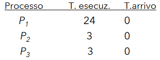

E supponiamo che i processi arrivino nell'ordine: *P1, P2, P3*. Il **diagramma di Gantt** per questa schedula è: 

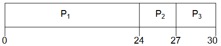

+ tempo di attesa: per $P1 = 0$, per $P2 = 24$, per $P3 = 27$
+ tempo medio di attesa: $17$
+ tempo medio di completamento: $(24+27+30)/3=27$
+ tempo medio di risposta: $(0+24+27)/3=17$

Supponiamo invece che l'ordine di arrivo sia: *P2, P3, P1*

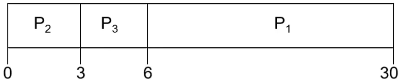

+ tempo di attesa: per $P1 = 6$, per $P2 = 0$, per $P3 = 3$
+ tempo medio di attesa: $3$
+ tempo medio di completamento: $(3+6+30)/3=13$
+ tempo medio di risposta: $(0+3+6)/3=3$

Possiamo notare che l'aver mandato in esecuzione i processi corti prima del processo lungo, ha portato a un miglioramento del tempo medio di attesa. Questo è vero in generale: chiamiamo **effetto convoglio** l'aumento del tempo di attesa dovuto all'esecuzione dei processi lunghi prima dei processi corti.

### Shortest Job First (SJF)

Associa a ogni processo la **lunghezza del prossimo CPU burst**. Queste lunghezze vengono usate per schedulare il processo con il minor tempo. Esistono due schemi: lo schema **non-preemptive**, ovvero che un processo non può essere schedulato prima che il corrente processo assegnato alla CPU abbia terminato il CPU burst; lo schema **preemptive**, cioè che se arriva un processo la cui lunghezza del CPU burst è inferiore al tempo rimanente al processo attualmente in esecuzione, allora questo nuovo processo viene assegnato alla CPU (Shortes Remaining Time First). L'SJF è detto **ottimale**, in quanto garantisce il minimo tempo medio di attesa per un insieme di processi fissati
  
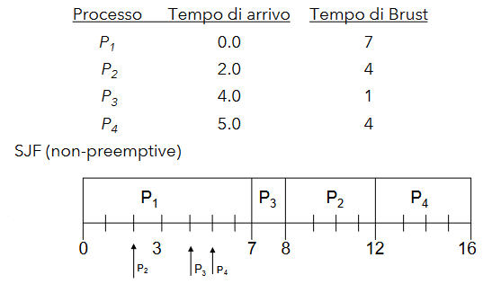

Le frecce indicano il tempo di arrivo dei vari processi

+ Tempo di attesa medio: $(0 + 6 + 3 + 7)/4 = 4$

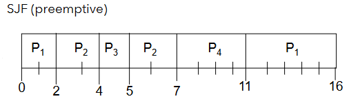

+ Tempo di attesa medio:  $(9 + 1 + 0 +2)/4 = 3$

Noi non possimao determinare la lunghezza del prossimo CPU burst; possiamo solo stimarlo valutando la storia passata dell'uso della CPU da parte dei processi e cercare di fare a una previsione. Facendo una media esponenziale:

+ t <sub>n</sub> = lunghezza dell' n-esimo CPU burst
+ $\tau$ = valore predetto per il prossimo CPU burst  
+ $\tau$<sub>0</sub> = valore iniziale preimpostato
+ $\alpha$, $0\leq\alpha\leq1$
+ $\tau$<sub>n+1</sub>  $= \alpha t$<sub>n</sub> $+(1+\alpha)\tau$<sub>n</sub>

### Scheduling con Priorità

A ogni processo viene associato un numero intero, che avrà il ruolo di priorità del processo stesso. La CPU è allocata dal processo con la priorità più alta (intero più basso) e lo scheduling in questo caso, può essere sia preemptive che non. <br> 
L'SJF è uno scheduling a priorità, dove la priorità è il tempo predetto del prossimo burst della CPU. 
Il problema che sussiste con questi tipi di scheduling è il così detto **starvation**: processi con priorità molto bassa non vengono mai eseguiti.
La soluzione consiste nell'incrementare la priorità al passare del tempo: **Aging** 

### Round Robin (RR)

In questo scheduling, ogni processo è allocato in CPU per una piccola parte di unità di tempo (time quantum, nell'ordine di 10-100 millisecondi). Dopo che questo *quanto* è trascorso, il processo viene interrotto e aggiunto alla fine della coda di ready. <br>
Se ci sono *n* processi nella coda di ready e il quanto è *q*, allora ogni processo prende *1/n* del tempo della CPU (spartito equamente tra i processi) in parti di al massimo *q* unità di tempo alla volta. Nessun processo aspetta più di *(n-1)/q* unità di tempo. <br>
Se *q* è grande, allora questo scheduling si comporta come lo scheduling FCFS; d'altra parte, se *q* è piccolo, il tempo di context switch aumenta.<br>
Vediamo un esempio con *q = 20*:

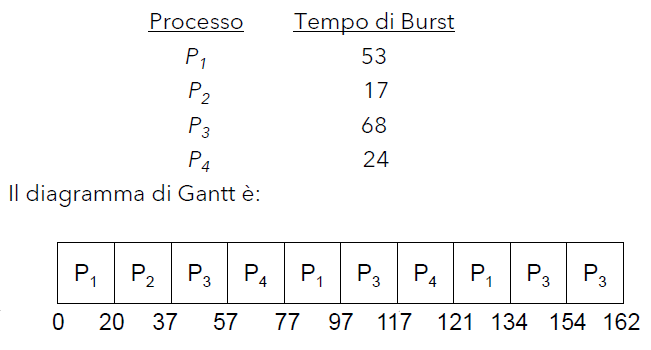 

+ Tempo di attesa medio: $(((77
20)+(121 97))+20+(37+(97 57)+(134 117))+(57+(117 77)))/4 =
(81 + 20 + 94 + 97) / 4 = 73$ (con SJF verrebbe 38)

tipicamente si ha un tempo di completamento medio più elevato rispetto a SJF, ma si ha un miglioramento nel tempo di risposta. <br>
Nell'esempio di sopra vengono eseguiti 9 context switch.

All'aumentare del quanto, diminuisce la media del tempo di completamento.

### Code multilivello

Un'altro modo in cui viene gestito lo scheduling: **La coda dei processi pronti è divisa in ulteriori code separate**, per esempio:

+ foreground (interattivi);
+ background (batch);

e ogni coda può essere gestita con un diverso algoritmo di scheduling. A questo punto il problema è fare lo scheduling tra le varie code. In che modo la CPU prende i processi dalle varie code? Lo scheduling tra le code può essere fatto con priorità (es. eseguo tutti i processi nella coda di foreground, poi quelli in background), oppure con un meccanismo di Time-Slice: ogni coda prende un certo tempo di CPU, in modo da garantire un tempo di CPU a tutti i processi. Anche in questo caso, lo scheduling con priorità può portare al problema della starvation delle code con più bassa prioirità e possiamo risolverlo con la retroazione tra le code: Un processo può passare da una coda all'altra. Nello scheduler multi livello con retroazione, dobbiamo definire i seguenti parametri:

+ Numero di code
+ Algoritmo di scheduling per ogni coda 
+ Metodo usato per determinare quando promuovere un processo 
+ Metodo usato per determinare quando retrocedere un processo
+ Metodo usato per determinare in quale coda un
processo deve entrare quando il processo necessita di
un servizio

Vediamo il seguente esempio: 
  ```
  Ci sono tre code:
    Q0: RR con time quantum 8 millisecondi
    Q1: RR con time quantum 16 millisecondi
    Q2: FCFS

  Un nuovo processo entra sempre nella coda Q0. Quabdo ottiene la CPU, il lavoro riceve 8 millisecondi. Se non riesce a finire in tempo allora viene spostato nella coda Q1. 

  Nella coda Q1 il processo ha un quanto di 16 millisecondi e, se non riesce a concludere in tempo, viene spostato nella coda Q2, dove viene eseguito un semplice FCFS.

  ```

  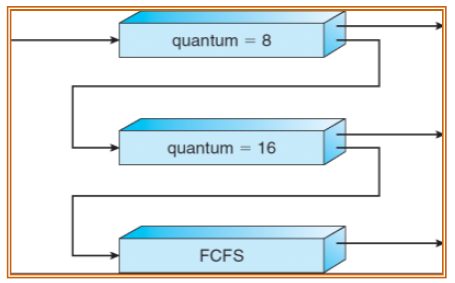

### Paramertri della CPU

I parametri che ci interessano sono:

+ Percentuale CPU usata: viene stabilito un intervallo temporale e viene calcolata la percentuale di questo tempo la CPU (o le CPU) è usata. E' facile dividere la percentuale tra i processi, per capire chi è che sta stressando maggiormente la CPU;
+ Carico medio CPU: Il carico medio della CPU è usato in ambienti UNIX per indicare il carico del sistema e quindi la sua capacità di eseguire i processi in modo regolare senza eccessivi ritardi

### Scheduling di Linux

Linux è un kernel open source, che permette di create sistemi molto eterogenei. Gli obiettivi di linux sono:

+ Timesharing
+ gestione dinaminca della priorità
+ gestione dei processi in tempo reale
+ evitare la starvation 
+ mantenere tempi brevi di risposta
+ throughput (prcessi completati per unità di tempo) elevato per processi in background: i processi in background non rimangono troppo indietro rispetto a quelli in foreground

prevede uno scheduling con prelazione sul codice utente; il codice kernel supporta la prelazione solo da versioni recenti di linux (kernel 2.6): una chiamata di sistema doveva arrivare a un punto in cui fosse sicuro interromperla. 

All'inizio, il kernel integrava uno scheduler basato su epoche, ovvero un processo poteva essere eseguito per un certo periodo di tempo, dopodichè veniva messo in coda e veniva eseguito un altro processo. Questo sistema era molto semplice, ma non permetteva di gestire i processi in modo dinamico. Il tempo per scegliere un processo da mandare in esecuzione dipendeva dal numero di processi in coda($O(n)$). Nel 2013, e stato introdotto uno scheduler Earlied Deadline First (EDF) per task periodci 
  
### Scheduling linux/POSIX

Linux segue la specifica **POSIX** riguardo allo scheduling, che si basa su una priorità statica e una dinamica (che viene calcolata in base alla priorità statica). La priorità statica è un numero intero tra 1 e 99, dove 99 è la priorità più alta, ed è usata per lo scheduling dei tast (soft) real-time. I task a priorità statica essere schedulati in due modi: 

+ **Scheduling FIFO**: quanto di tempo illimitato. Un processo lascia la CPU solo se si blocca in attesa di una risorsa I/O, se termina o se arriva un processo con più alta priorità 
+ **Scheduling RR**

Se un processo della coda FIFO entra in loop infinito sulla (unica) CPU, il sistema può bloccarsi. <br>
Per i task normali viene usata la priorità statica 0 e sono schedulati secondo la politca OTHER/NORMAL, nella quale i task hanno priorità dinamica   

### Scheduling kernel 2.4, basato su epoche

I task a priorità statica 0 vengono schedulati con una politica basata su epoche: A ogni processo è assegnato un quanto di tempo, consumato durante l'epoca; la priorità dinamica è legata alla lunghezza del quanto. Quando tutti i task della coda di ready hanno terminato il proprio quanto, l'epoca è finita è vengono ricalcolati i quanti di tempo per l'epoca successiva, aumentando (della metà di quanto rimasto precedentemente) se il processo non ha terminato il proprio quanto, favorendo in questo modo i proessi interattivi o con I/O bound. Il task può variare il proprio quanto (e quindi la propria priorità), attraverso il valore **nice** [-20,19] dove i valori negativi aumentano la priorità. Per decidere il task da mandare in esecuzione viene fatta una scansione di tutti i processi nella coda di ready; questo rende molto lento lo scheduling ($O(n)$). <br>
Tutte le CPU accedono a un'unica coda di ready, quindi non possono accedervi contemporaneamente. 

### Scheduler O(1)

Questo sistema riduce il tempo di scelta del task da mandare in esecuzione (su N task) a un tempo costante, usando una tabella di hashing. <br>
Sono previsti 140 livelli di priorità, in cui il livello 0 è quello più alto e sono organizzati in questo modo:

+ 0-99 per i task real-time
+ 100-139 per i task normali (120+nice)

Per ogni livello di priorità, esistono due code: una per i task con quanto di tempo non esaurito (ACTIVE) e una per i task con quanto esaurito (EXPIRED).


Lo scheduler sceglie i task in tesa alla coda a priorità più alta dalla lista ACTIVE; quando ha terminato il quanto viene messa nella corrispondente coda della lista EXPIRED. Quando la coda ACTIVE è vuota, lo scheduler scambia le due liste. <br>
Trovare la priorità per cui esiste almeno un task attivo si fa in tempo costante rispetto al numero di task totale: $O(1)$

Può capitare che un task a bassa priorità non venga mai eseguita se ci sono sempre task a priorità più alta, casusando uno starvation. Per ovviare a questo problema, i task I/O bound vengono premiati e quelli CPU bound vengono penalizzati, con un incremento o decremento della priorità in un range di 5 livelli. La promozione è basata sul calcolo **sleep_avg** del task:

+ Incrementato del tempo in cui è stato in sleep, fino a un massimo 
+ decrementato del tempo in cui ha usato la CPU

Il bonus non può far passare i task non real time sopra la priorità 100. <br>
Esistono altri bonus, chiamati interactivity credits, che servono per evitare che un task I/O bound venga penalizzato troppo se esegue un'operazione di I/O molto lunga.

In questo caso Ogni CPU ha la sua coda dei processi, i quali vengono spostati per bilanciare il carico delle CPU.

C'è da dire che gestire tutte le euristiche dei bonus è complicato. Per questo motivo è stato introdotto il CFS (Completely Fair Scheduler).

### Completely Fair Scheduler (CFS)

A ogni task (non real time) è associato un **virtual_runtime**, che identifica il tempo di uso della CPU. Per decidere quale task nella coda di ready allocare, viene selezionato il task con il minor virtual_runtime. <br>
I task sono organizzati in un albero rosso-nero, in cui ogni nodo rappresenta un task, identificato dal proprio virtual_runtime: 


Questo garantisce un tempo di scelta del task pari a $O(log(n))$, dove n è il numero di task nella coda di ready. <br>

Il virtual_runtime viene aggiornato sulla base del nice value del task (priorità statica). Il tempo effettivo di CPU viene moltiplicato per $1.25$<sup>nice</sup>:

+ CPU più veloce per task ad alta priorità (nice = -20)
+ CPU più lenta per task a bassa priorità (nice = 19)

Un task viene selezionato ed eseguito, quando verrà fermato verrà aggiornato il suo virtual_runtime e se entra nella coda ready viene inserito nell'albero RB. <br>
I task I/O bound tendono ad usare poca CPU e quindi tendono ad
essere selezionati prima di quelli CPU bound. <br>
Anche il quanto di tempo assegnato dipende dal valore di nice del task: weight = $1024 / (1.25)$<sup>nice</sup>. <br>
Il quanto viene calcolato sulla base di tutti gli weight dei task nella coda di ready:

+ **scheduling_period** = $max (n * sched_min_granularity_ns ,sched_latency_ns)$
+ **time_slce**(T<sub>k</sub>) = $scheduling_period * weight / total_weight$

All’aumentare della priorità (nice level basso) avrà un timeslice più grande rispetto agli altri task.

### Classi di Scheduling

Con il kernel 2.6.23 è stato riorganizzato il codice per lo scheduling ed è definita un'interfaccia per algoritmi di scheduling. QUesto permette di definire nel kernel più **classi di scheuing**, ognuna gesita con il proprio algoritmo.

## Sincronizzazione tra processi

L'accesso concorrente a dati condivisi può portare ad avere dei dati inconsistenti, dovuto a:

+ Scheduling con prelazione in monoprocessore
+ Accesso parallelo alla memoria in un'ambiente multiprocessore

è necessario implementare dei meccanismi per assicurare l'esecuzione ordinata dei processi concorrenti, in modo da evitare casi inconsistenti. <br>
Supponiamo di realizzare un **processo/ thread produttore** e un **processo/ thread consumatore** che condividono una zona di memoria per memorizzare degli elementi: viene usata una variabile condivisa **count** che tiene traccia di quanti elementi sono pronti per il consumatore; count viene incrementata dal thread produttore quando un nuovo elemento è disponibile e viene decrementata dal consumatore quando consuma l'elemento. Vediamo i thread:

+ Thread produttore:
  ```C
  while (true) {
      nextProduced = produce();      //produce un elemento per il consumatore e lo mette in nextProduced
      while (count == BUFFER_SIZE);
        //non fare niente
      buffer[in] = nextProduced;     //mette l'elemento nel buffer
      in = (in + 1) % BUFFER_SIZE;   //incrementa l'indice
      count++;
  }
  ```
+ Thread consumatore
  ```C
  while (true) {
      while (count == 0);
        //non fare niente
      nextConsumed = buffer[out];    //prende l'elemento dal buffer
      out = (out + 1) % BUFFER_SIZE; //incrementa l'indice
      count--;
      consume(nextConsumed);         //consuma l'elemento
  }
  ```

**count++** potrebbe essere implementato così:

+ ```assembly
  register1 = count;
  register1 = register1 + 1;
  count = register1;
  ```

e **count--** potrebbe essere implementato così:

+ ```assembly
    register1 = count;
    register1 = register1 - 1;
    count = register1;
  ```

Se le singole operazioni che compongono count++ e count-- non sono atomiche, potrebbe capitare che il valore di count non sia quello atteso. <br>
Le istruzioni count++ e count-- sono dette **sezini critiche** dei due thread e portano a delle situazioni di **Race Condition**: il risultato finale dipende dall'ordine di esecuzione delle istruzioni. In generale si ha una race condition quando vengono eseguite operazioni di lettura e scrittura di un dato condiviso da più thread.

Vediamo le proprietà delle sezioni critiche:

+ *Mutua esclusione*: Se il processo *P<sub>i</sub>* è in esecuzione nella sua sezione critica, allora nessun altro processo può essere in esecuzione nella sua sezione critica;
+ *Progresso*: Se nessun processo è nella sua sezione critica e esistono processi che vogliono entrarvi, allora la scelta dal processo che può entrare nella sezione critica non può essere rimandata indefinitamente;
+ *Attesa limitata*: Deve esistere un limite al numero di volte che altri processi possono entrare nella sezione critica dopo che un processo ha richiesto di entrare nella sezione critica e prima che questa richiesta venga soddisfatta:
  + Assume che ogni processo venga eseguito a velocità non nulla
  + Nessuna assunzione sulla velocità relativa degli N processi 

### Soluzione di Peterson

La soluzione di Peterson è una soluzione software utlizzabile solo per due processi. <br>
Si assume che le operazioni di LOAD e STORE siano atomiche.
I due processi condividono due variabili:

+ int **turn**: indica il processo che può entrare nella sezione critica
+ bool **flag[2]**: indica se il processo vuole entrare nella sezione critica

```C
//processo 0
do {
    flag[0] = true;
    turn = 1;
    while (flag[1] && turn == 1);
        //non fare niente (aspetta che il processo 1 finisca)
    //sezione critica
    flag[0] = false;
    //sezione non critica
} while (true);

//processo 1
do {
    flag[1] = true;
    turn = 0;
    while (flag[0] && turn == 0);
        //non fare niente (aspetta che il processo 0 finisca)
    //sezione critica
    flag[1] = false;
    //sezione non critica
} while (true);
```

La mutua esclusione è garantita, perché se entrambi i processi fossero nella sezione critica avremmo che flag[0] = flag[1] = true e turn = 0 = 1, ma questo è impossibile. <br>
Il progresso è garantito, perché se uno dei due processi vuole entrare nella sezione critica sicuramente uno dei due entra (dipende dal valore di turn).<br>
Dopo che P<sub>0</sub> è entrato e P<sub>1</sub> è in attesa, se P<sub>0</sub> richiede nuovamente di entrare allora viene prima sbloccato P<sub>1</sub> e poi verrà gestito P<sub>0</sub>... quindi anche l'attesa limitata è garantita.

### Algoritmo del Fornaio (Lamport)

Questa è una soluzione più generale, per N processi. L'idea è gestire i thread come se fossero dei clienti in fila, in attesa: Un thread prende un numero e poi aspetta che il suo numero sia il prossimo da servire, ovvero il più piccolo. <br>
Sono usati due vettori di N elementi condivisi tra gli N processi:
+ int **number[N]**: contiene i numeri "presi" dai processi per entrare nella sezione critica (0 se il processo non vuole ci vuole entrare)
+ bool **choosing[N]**: indica che il processo è in fase di scelta del numero

```C
process P(i){
  do {
    choosing[i] = true;
    number[i] = max(number[0], ..., number[N-1]) + 1;
    choosing[i] = false;
    for (j = 0; j < N; j++) {
        while (choosing[j]);
        while (number[j] != 0 && (number[j] < number[i] || (number[j] == number[i] && j < i)));
    }
    //sezione critica
    number[i] = 0;
    //sezione non critica
  } while (true);
}
```

Nella fase di scelta del numero due o più processi ossono prendere lo stesso numero. In questo caso verrà scelto il processo con l'indice più piccolo. <br>

 >N.B: (number[j] < number[i] || (number[j] == number[i] && j < i)) corrisponde a (number[j], j) < (number[i], i) in ordine lessicografico. Per comodità useremo questa seconda sintassi

La mutua esclusione è garantita, perché se due processi x e y fossero entrambi nella sezione critica si avrebbe *(number[x], x) < (number[y], y)* e *(number[y], y) < (number[x], x)*, ma questo è impossibile. <br>
Il progresso è garantito, perché se nessuno è nella sezione critca e più processi vogliono entrare, allora sicuramente uno dei processi entrerà. <br>
Anche l'attesa limitata è garantita: i valori di *number[]* aumentano sempre, quindi se un processo è in attesa prima o poi il suo numero sarà il più piccolo e quindi entrerà nella sezione critica.


